# Kiến trúc Hệ thống (System Architecture)

Ứng dụng "Trợ lý Thủ tục Hành chính" là một hệ thống hỗ trợ người dân thực hiện các thủ tục hành chính công thông qua giao diện tương tác thông minh và an toàn. Hệ thống kết hợp khả năng hiểu ngữ nghĩa của AI với tính chính xác tuyệt đối của công cụ luật tĩnh (rule engine) và máy trạng thái (state machine) nhằm đảm bảo các thông tin pháp lý luôn chính xác 100%.

## 1. Sơ đồ hệ thống (System Flow Diagram)

Dưới đây là sơ đồ luồng dữ liệu và các chốt bảo mật từ yêu cầu của người dân đến lớp xử lý nghiệp vụ và tích hợp AI.

```mermaid
flowchart TD
  subgraph BusinessLane ["Luồng nghiệp vụ"]
    Citizen["Citizen / Widget"] --> Pages["Next.js App Router pages"]
    Pages --> rateLimit["rateLimit"]
    rateLimit --> cache["cache"]
    cache --> idempotency["idempotency"]
    idempotency --> sessionAuth["sessionAuth (capability token)"]
    sessionAuth --> RouteHandlers["/api/v1 route handlers"]
    
    Pages --> adminAuth["adminAuth (deny-by-default)"]
    adminAuth --> AdminHandlers["/api/v1/admin/* route handlers"]
    
    RouteHandlers --> IntentMatcher["intent matcher"]
    IntentMatcher --> LlmFallback["LLM fallback"]
    
    RouteHandlers --> IntakeStateMachine["intake state machine"]
    
    RouteHandlers --> RuleEngine["rule engine"]
    
    IntentMatcher --> Prisma["Prisma"]
    LlmFallback --> Prisma
    IntakeStateMachine --> Prisma
    RuleEngine --> Prisma
    AdminHandlers --> Prisma
    
    Prisma --> DB[("PostgreSQL")]
  end

  subgraph AILane ["Lớp AI"]
    LLMSeam["llm.ts"]
    STTSeam["stt.ts"]
    TTSSeam["tts.ts"]
    
    EgressGuard["egress guard (HTTPS + host allowlist)"]
    Upstream["OpenAI-compatible upstream"]
    MockFallback["deterministic mock fallback (degraded=true)"]
    
    LLMSeam --> EgressGuard
    STTSeam --> EgressGuard
    TTSSeam --> EgressGuard
    
    EgressGuard --> Upstream
    
    LLMSeam --> MockFallback
    STTSeam --> MockFallback
    TTSSeam --> MockFallback
  end
```



## 2. Bảng đặc tả các mô hình AI (AI Models)

Hệ thống tích hợp các dịch vụ trí tuệ nhân tạo để tối ưu hóa trải nghiệm người dùng thông qua các cổng giao tiếp chuẩn hóa. Khi cấu hình `AI_PROVIDER=mock`, hệ thống sẽ sử dụng các nhà cung cấp giả lập cục bộ mà không cần kết nối mạng.

| Model | Vai trò | Ràng buộc |
| :--- | :--- | :--- |
| **DeepSeek-V4-Flash** (FPT AI Marketplace) | Intent fallback + Error explanation | Phân loại ý định khi từ khóa không khớp và giải thích mã lỗi nghiệp vụ bằng Plain Vietnamese. Sử dụng đầu ra ràng buộc định dạng JSON (`response_format: { type: "json_object" }`) và tắt chế độ reasoning qua `LLM_DISABLE_THINKING=1` để kết quả nằm trong `message.content`. |
| **FPT.AI-whisper-large-v3-turbo** | STT | Whisper tinh chỉnh trên hơn 50.000 giờ giọng nói tiếng Việt; chuyển giọng nói từ micro thành văn bản phục vụ phân loại ý định. |
| **FPT.AI-VITs** | TTS | Chuyển văn bản hướng dẫn thành giọng nói tiếng Việt (9 giọng Bắc/Nam). Bản đồ giọng nói qua env: `vi-female` -> `banmai` / `vi-male` -> `leminh`. |

Tất cả các dịch vụ AI hoạt động thông qua một endpoint tương thích với `OPENAI_BASE_URL`. Trong trường hợp phát sinh lỗi kết nối với dịch vụ Live AI, hệ thống sẽ tự động hạ cấp xuống dịch vụ mock nội bộ với cờ hiệu `degraded=true`.

### Cấu hình & kiểm soát egress

Để ngăn chặn các nguy cơ tấn công yêu cầu giả mạo từ máy chủ (SSRF) và bảo vệ an toàn hệ thống, các luồng dữ liệu ra ngoài (egress) của lớp AI bắt buộc phải tuân thủ các quy tắc sau:

1. Địa chỉ `OPENAI_BASE_URL` bắt buộc chỉ được đọc từ cấu hình khởi chạy đáng tin cậy của máy chủ (biến môi trường được tiêm vào tại thời điểm triển khai) và không bao giờ được phép ghi đè hoặc cấu hình trực tiếp từ dữ liệu đầu vào của người dùng.
2. Địa chỉ URL bắt buộc phải được phân tích bằng thư viện URL tiêu chuẩn và sử dụng giao thức bảo mật `https://` (ngoại trừ địa chỉ localhost sử dụng giao thức `http://` chỉ được chấp nhận trong môi trường phát triển khi `NODE_ENV !== 'production'`).
3. Địa chỉ URL bắt buộc không được chứa thông tin xác thực nhúng (embedded username/password).
4. Tên máy chủ (host) bắt buộc phải nằm trong danh sách allowlist được cấu hình sẵn cho các nhà cung cấp dịch vụ AI được phê duyệt.
5. Sau khi phân giải DNS (DNS resolution), mọi yêu cầu gửi đến các địa chỉ loopback (127.0.0.1/::1), dải IP riêng tư RFC1918, link-local, hoặc địa chỉ metadata của đám mây (`169.254.169.254`) bắt buộc phải bị từ chối ngay lập tức.
6. Hệ thống bắt buộc không đi theo các liên kết chuyển hướng (redirect) nằm ngoài origin được chấp thuận.
7. Khóa API `OPENAI_API_KEY` bắt buộc chỉ được đính kèm vào các yêu cầu gửi đến origin đã được kiểm duyệt.
8. Khi cấu hình `AI_PROVIDER=mock`, hệ thống bắt buộc không thực hiện bất kỳ yêu cầu mạng nào ra bên ngoài (no network egress).

## 3. Grounding & an toàn AI (Grounding & Safety)

Để ngăn chặn các hiện tượng ảo giác (hallucination) của mô hình ngôn ngữ lớn làm ảnh hưởng đến tính chính xác pháp lý của thủ tục hành chính, hệ thống thực thi các cơ chế bảo vệ nghiêm ngặt:

1. **Closed-set selection:** Mô hình LLM trong pha phân loại ý định bắt buộc chỉ được chọn các mã thủ tục (`procedureCode`) từ danh mục cơ sở dữ liệu (DB catalog) được gửi kèm trong Prompt.
2. **Confidence floor:** Nếu điểm tin cậy của kết quả phân loại ý định dưới **0.6**, hệ thống bắt buộc phải hiển thị thông báo yêu cầu người dân làm rõ ý định một cách tất định thay vì cố gắng suy đoán hành động tiếp theo.
3. **Validation separation:** Quy trình kiểm tra dữ liệu biểu mẫu bắt buộc không bao giờ sử dụng LLM mà chỉ do công cụ luật tĩnh (`rule-engine.ts`) xử lý để đảm bảo tính tất định.
4. **Data privacy:** Khi giải thích mã lỗi nghiệp vụ, mô hình LLM giải thích lỗi bắt buộc chỉ nhận danh sách `{code, field id}` của các lỗi, tuyệt đối không được tiếp cận dữ liệu cá nhân (PII) hoặc các nội dung tự do do người dân điền.

## 4. Bảo mật & phân quyền (Security & Authorization)

Hệ thống triển khai mô hình bảo mật nhiều lớp nhằm bảo vệ tài nguyên người dùng và ranh giới quản trị.

### Cơ chế Token phiên (Session Capability Token)

Để bảo vệ chống lại các lỗ hổng phân quyền đối tượng bị hỏng (BOLA) và bảo vệ phiên làm việc của người dân:

1. Endpoint khởi tạo phiên bắt buộc phát hành một mã token ngẫu nhiên mã hóa 256-bit (CSPRNG, base64url encoded) và chỉ trả về giá trị thô này duy nhất một lần cho khách hàng.
2. Hệ thống bắt buộc chỉ lưu trữ mã băm SHA-256 (`accessTokenHash`) của token trong cơ sở dữ liệu thông qua hàm `hashToken`, tuyệt đối không lưu trữ hoặc ghi nhật ký (log) mã thô.
3. Tất cả các yêu cầu truy cập tài nguyên liên kết với phiên hoặc ứng dụng hồ sơ (bao gồm các bước trả lời, tạo/đọc/cập nhật hồ sơ ứng dụng, upload và các tuyến STT/TTS liên quan) bắt buộc phải cung cấp token qua header `X-Session-Token`.
4. Việc xác thực token bắt buộc được thực hiện bằng cách băm mã nhận được và so sánh với mã băm lưu trong DB bằng thuật toán so sánh thời gian không đổi `crypto.timingSafeEqual` để tránh tấn công kênh kề (timing attack).
5. Mã token bắt buộc hết hạn tự động sau 24 giờ kể từ thời điểm phát hành (dựa trên cấu hình `SESSION_TTL_HOURS`).
6. Bản ghi hồ sơ ứng dụng (`Application`) bắt buộc được ràng buộc với phiên sở hữu (`Session`). Mọi yêu cầu truy cập từ một phiên khác bắt buộc phải bị từ chối.
7. Khi token không tồn tại, hết hạn hoặc không khớp với mã định danh hồ sơ, hệ thống bắt buộc trả về một phản hồi lỗi chung duy nhất (mã trạng thái `404 Not Found` với thân lỗi không tiết lộ thông tin) để ngăn chặn kẻ tấn công dò tìm sự tồn tại của hồ sơ người dùng khác.

### Ranh giới quản trị (Admin Boundary)

Để bảo vệ các chức năng quản trị hệ thống và kiểm soát thay đổi biểu mẫu:

1. Mọi API thuộc `/api/v1/admin/*` bắt buộc phải tự thực thi xác thực quyền hạn quản trị độc lập thông qua việc so khớp mã băm của header `X-Admin-Token` với giá trị cấu hình `ADMIN_TOKEN` bằng thuật toán so sánh thời gian không đổi. Các biện pháp bảo vệ bắt buộc được thực thi trong mã nguồn của route hoặc middleware nghiệp vụ, không dựa vào việc ẩn giao diện UI hoặc đặt tên route ẩn.
2. Hệ thống áp dụng cơ chế khóa tạm thời: nếu một địa chỉ IP thực hiện sai quá 5 lần trong vòng 15 phút, hệ thống bắt buộc chặn các yêu cầu xác thực quản trị tiếp theo từ IP đó và trả về mã lỗi `429 Rate Limited` (dựa trên rate limiter bucket `admin-auth`).
3. Mọi hành động phê duyệt yêu cầu thay đổi phiên bản biểu mẫu bắt buộc phải ghi nhận vào một nhật ký kiểm toán không thể thay đổi (immutable audit trail) trong DB (trường `reviewedBy` của bảng `ChangeRequest`) lưu thông tin định danh tài khoản thực hiện, hành động, đối tượng chịu tác động và dấu thời gian.

## 5. Bề mặt API (API Surface)

Dưới đây là danh sách các endpoint khả dụng trong mã nguồn hiện tại của hệ thống. Chi tiết về hợp đồng API đầy đủ có thể được xem tại [openapi.yaml](../openapi.yaml).

- `POST /api/v1/procedures/search` — Tìm kiếm thủ tục hành chính dựa trên mô tả hoặc từ khóa của người dân — `[Public]`
- `POST /api/v1/forms/{formCode}/validate` — Thực hiện kiểm tra nghiệp vụ bằng rule engine và giải thích lỗi qua AI — `[Session token]`
- `POST /api/v1/applications` — Tạo hồ sơ nháp mới từ phiên hướng dẫn hiện tại — `[Session token]`
- `GET /api/v1/applications/{id}` — Truy xuất thông tin chi tiết và danh sách trường của hồ sơ nháp — `[Session token]`
- `PUT /api/v1/applications/{id}` — Lưu dữ liệu biểu mẫu của người dân vào hồ sơ nháp với cơ chế kiểm soát tranh chấp đồng thời — `[Session token]`
- `POST /api/v1/admin/change-requests/{id}/approve` — Phê duyệt yêu cầu thay đổi và kích hoạt phiên bản biểu mẫu mới trên hệ thống — `[Admin]`
```